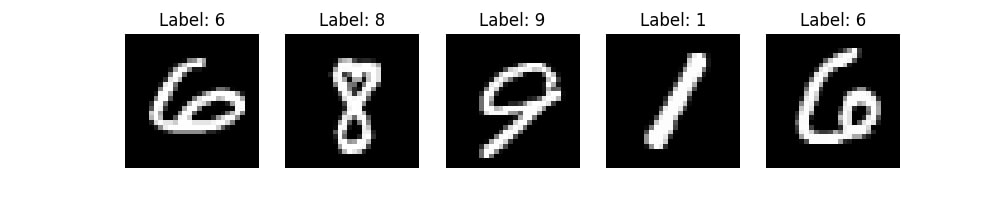

# Handwriting Recognition Application

### Identify Single Digits or a Sequence of Digits

- showcasing a little & simple project where I built and trained 2 models:

1. **HCRM** -> classifies single handwritten digits
2. **HSRM (LSTM)** -> classifies a sequence of handwritten digits up to a max sequence length of 5 (it still has some bugs)

- to train the LSTM, I used a custom sequence dataset, where a training instance is a concatenation of five images, resulting to a digit sequence.
  Like so:
  

- Performance of the sequence digit model:
  

- Additionally, I wrote a script to calculate the flops, with respect to the model.
  - The single character model reached **2.1e+10** FLOPS
